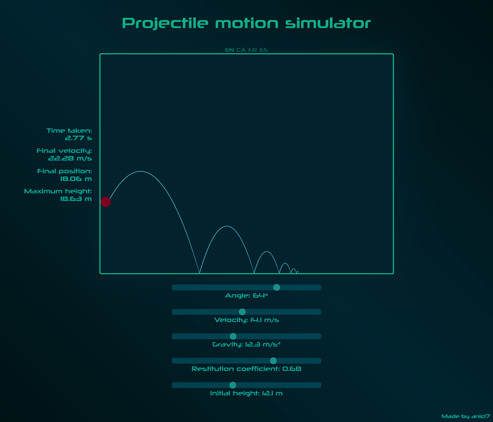

# Projectile Simulator

This program allows you to simulate projectile physics with variable initial conditions to see how it behaves. Feel free to play with it.

The purpose of making this projectile motion simulator was to learn a bit about JavaScript's 2D canvas and improve my web designing skills.

See the **[Live demo](https://anic17.github.io/projectile-simulator)**

## Features

 - Path preview
 - Object bouncing & realistic collision physics
 - Five initial conditions that can be altered:
    - Angle
    - Initial speed
    - Gravity
    - Restitution coefficient
    - Initial height
 - Display of information about:
    - Time taken
    - Final velocity
    - Final position
    - Maximum height

# Languages

The website is available in four languages: English (default), Catalan, French and Spanish.
The language preferences get saved every time a language is selected.

# Screenshot

</img>
###### Screenshot showing the user interface and the path of the ball

**Copyright &copy; 2024 anic17 Software**
